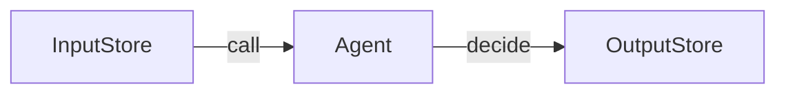
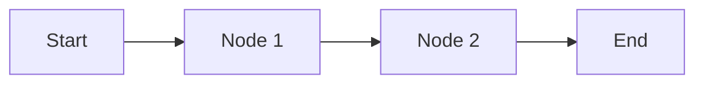
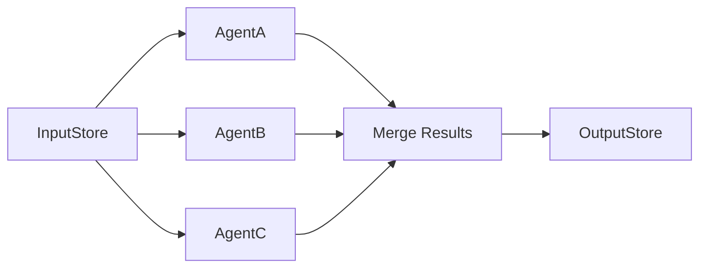
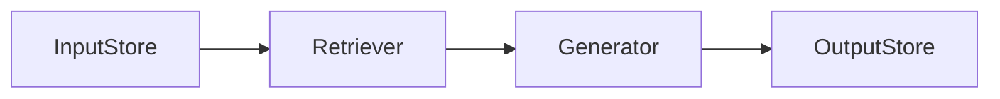
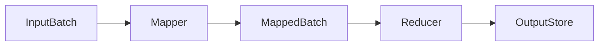

# agentflow-typescript

A minimalist, async-first TypeScript framework for building, orchestrating, and managing AI agents and workflows. Inspired by the Rust AgentFlow crate.

AgentFlow TypeScript is a robust, production-ready framework designed to empower developers to build, orchestrate, and manage advanced AI agents and workflows with ease. Leveraging modern async/await patterns, AgentFlow enables the composition of autonomous agents, complex workflows, and multi-agent systems for a wide range of AI applications. Its architecture emphasizes composability, extensibility, and performance, making it ideal for rapid prototyping as well as scalable, production-grade solutions. With built-in support for patterns like RAG (Retrieval-Augmented Generation), MapReduce, and parallel agent execution, AgentFlow TypeScript provides a flexible foundation for building intelligent, language-agnostic pipelines that integrate seamlessly with leading LLMs and external tools.

---

## Features

- **Agent**: Autonomous async decision-making unit with retry logic.
- **Workflow**: Chain of agents with conditional routing and branching.
- **MultiAgent**: Parallel or coordinated agent execution.
- **RAG**: Retrieval-Augmented Generation (retriever + generator).
- **MapReduce**: Batch map and reduce over data.
- **Composable**: Build complex systems from simple, reusable async parts.
- **Async-first**: Designed for async/await and concurrent execution.

---

## Requirements

- **Node.js v18+** (for `readline/promises`, ES2020 features, and Gemini support)
- **TypeScript** (already included as a dev dependency)
- **ts-node** (for running examples directly; install with `npm install --save-dev ts-node` if not present)

---

## Installation

```bash
npm install agentflow-typescript
```

---

## Mermaid Diagrams

### Agent Pattern



### Workflow Pattern



### MultiAgent Pattern



### RAG Pattern



### MapReduce Pattern



---

## Quickstart

```typescript
import { Agent, createNode, Workflow } from "agentflow-typescript";

// Example agent
const helloAgent = createNode(async (store) => {
    store.greeting = `Hello, ${store.name || "stranger"}!`;
    return store;
});

const agent = new Agent(helloAgent, 2, 100);
agent.decide({ name: "Alice" }).then(console.log);

// Example workflow
const wf = new Workflow();
wf.addStep("step1", async s => ({ ...s, step1: "Research done", action: "default" }));
wf.addStep("step2", async s => ({ ...s, step2: "Code generated", action: "default" }));
wf.connect("step1", "step2");
wf.run({}).then(console.log);
```

---

## API Documentation

### `createNode(fn: Node): Node`
Wraps an async function as a AgentFlow node.

**Parameters:**
- `fn`: `(store: SharedStore) => Promise<SharedStore>`

**Returns:**  
A node function.

---

### `Agent`
An autonomous async agent with retry logic.

**Constructor:**
```typescript
new Agent(node: Node, maxRetries = 1, waitMillis = 0)
```
- `node`: The node to wrap.
- `maxRetries`: Number of retries on failure.
- `waitMillis`: Milliseconds to wait between retries.

**Method:**
- `decide(input: SharedStore): Promise<SharedStore>`

---

### `Workflow`
Chains nodes into a directed workflow.

**Methods:**
- `addStep(name: string, node: Node)`
- `connect(from: string, to: string, action = "default")`
- `run(store: SharedStore): Promise<SharedStore>`

---

### `MultiAgent`
Runs multiple agents in parallel and merges their results.

**Methods:**
- `addAgent(agent: Node)`
- `run(store: SharedStore): Promise<SharedStore>`

---

### `Rag`
Retrieval-Augmented Generation pattern.

**Constructor:**
```typescript
new Rag(retriever: Node, generator: Node)
```
- `call(store: SharedStore): Promise<SharedStore>`

---

### `MapReduce`
Batch map and reduce pattern.

**Constructor:**
```typescript
new MapReduce(mapper: Node, reducer: (stores: SharedStore[]) => Promise<SharedStore>)
```
- `run(inputs: SharedStore[]): Promise<SharedStore>`

---

## Real-World Examples

All examples are in the [`examples/`](./examples/) directory.  
**You must set your API keys and install dependencies before running any example.**

### 1. Set your API keys

```bash
export OPENAI_API_KEY=sk-...
export GEMINI_API_KEY=...
```

### 2. Install dependencies

```bash
npm install
npm install openai @google/generative-ai
npm install --save-dev ts-node
```

### 3. Build the project (optional for examples)

```bash
npm run build
```

### 4. Run an example

**From the project root, run:**

```bash
npx ts-node examples/agent.ts
npx ts-node examples/async_agent.ts
npx ts-node examples/multi_agent.ts
npx ts-node examples/orchestrator_multi_agent.ts
npx ts-node examples/rag.ts
npx ts-node examples/mapreduce.ts
npx ts-node examples/structured_output.ts
npx ts-node examples/workflow.ts
```

> **Note:**  
> If you see an error like `Cannot find module './openai.1'` in `mapreduce.ts`,  
> simply rename `openai.1.ts` to `openai.ts` in the `examples/` directory, or update the import in `mapreduce.ts` to:
> ```typescript
> import { openai } from "./openai";
> ```

Or, if you prefer to use compiled JavaScript:

```bash
node dist/examples/agent.js
```
(You may need to copy or build the examples into `dist/`.)

---

## Example Descriptions & Expected Output

### `agent.ts` – Run a single OpenAI agent with a prompt

**Command:**
```bash
npx ts-node examples/agent.ts
```
**Expected output:**
```
[OpenAI response]:
 O, wondrous mind of silicon birth,
 In circuits deep, thou show’st thy worth...
```

---

### `async_agent.ts` – Run two OpenAI agents concurrently

**Command:**
```bash
npx ts-node examples/async_agent.ts
```
**Expected output:**
```
Agent 1 (poetry) response:
 Rust async, swift streams,
 Code flows like a mountain breeze,
 Nature in the core.

Agent 2 (summarization) response:
 Concurrency allows multiple tasks to run in parallel, improving efficiency and responsiveness...
```

---

### `multi_agent.ts` – Run OpenAI and Gemini agents in parallel and merge results

**Command:**
```bash
npx ts-node examples/multi_agent.ts
```
**Expected output:**
```
=== Space Invader Game Artifacts ===
--- TypeScript Game Logic ---
 // ...TypeScript code...
--- HTML Structure ---
 // ...HTML code...
--- TailwindCSS Styles ---
 // ...TailwindCSS or CSS...
```

---

### `orchestrator_multi_agent.ts` – Human-in-the-loop multi-phase orchestration (OpenAI + Gemini)

**Command:**
```bash
npx ts-node examples/orchestrator_multi_agent.ts
```
**Expected output:**
```
🎯 Orchestrator Report

📚 Research Facts:
 1. Maple syrup is made from the sap of sugar maple trees...
🧑‍💻 TypeScript Code:
 function printMapleSyrupFact() { ... }
🔍 Review:
 The code is correct and follows TypeScript best practices...
✅ All phases complete.
```

---

### `rag.ts` – Retrieval-Augmented Generation (retriever + generator)

**Command:**
```bash
npx ts-node examples/rag.ts
```
**Expected output:**
```
User Query: What are the main features of Rust for web development?
[Final Retrieved Context]
 Rust offers strong safety guarantees, async support, and WebAssembly compilation...
[Final Generated Answer]
 Rust is ideal for web development due to its safety, performance, and async capabilities...
```

---

### `mapreduce.ts` – Map and reduce over a batch of documents

**Command:**
```bash
npx ts-node examples/mapreduce.ts
```
> **Note:**  
> If you see an error about `openai.1`, update the import in `mapreduce.ts` to:
> ```typescript
> import { openai } from "./openai";
> ```
> or rename `openai.1.ts` to `openai.ts`.

**Expected output:**
```
All Summaries:
 Rust is a systems programming language...
 Async programming enables concurrency...
 LLMs are transforming software development...
```

---

### `structured_output.ts` – Compose a pipeline with structured output and CLI interaction

**Command:**
```bash
npx ts-node examples/structured_output.ts
```
**Expected output:**
```
=== Research & Critique CLI ===
1. Enter new topic to process
2. Revise last response (re-run all agents on last topic)
3. Cancel and show prettified output
Choose an action: 1
Please enter a topic for research, summary, and critique: Rust async

=== Structured Output ===
{
  "status": "success",
  "topic": "Rust async",
  "research": "...",
  "summary": "...",
  "critique": "...",
  "timestamp": "2025-08-25T12:34:56.789Z"
}
```

---

### `workflow.ts` – Interactive workflow for a land title process (with user input)

**Command:**
```bash
npx ts-node examples/workflow.ts
```
**Expected output:**
```
--- Step: title_search ---
Result of last processing:
 The title is clear for transfer. Prior owners: ...

Options: [a]pprove, [r]equest revision, [d]eny/restart, [c]ancel
Your choice: a

--- Step: title_issuance ---
Result of last processing:
 Draft land title issuance for John Doe, Plot 40, Maple Estate...

Options: [a]pprove, [r]equest revision, [d]eny/restart, [c]ancel
Your choice: a

--- Step: legal_review ---
Result of last processing:
 The draft is legally sufficient. No corrections needed.

Options: [a]pprove, [r]equest revision, [d]eny/restart, [c]ancel
Your choice: a

Workflow complete. Final result:
title_search: ...
title_issuance: ...
legal_review: ...
```

---

## License

MIT OR Apache-2.0

---
_Last updated: 2025-08-25_
